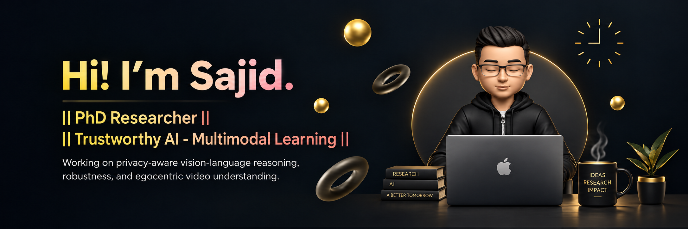

  

  
  
  
  

 

### 👋 About Me

I am a **PhD student in Computer Science at [Wayne State University](https://wayne.edu/)**, advised by **[Prof. Dongxiao Zhu](https://dongxiaozhu.github.io/)**.

My research lies at the intersection of **multimodal learning** and **trustworthy AI**, with much of my current work centered on **Large Vision-Language Models (LVLMs)**.

- 🔐 Privacy-aware vision-language reasoning
- 🛡️ Adversarial attacks, defenses & robustness
- 🎥 Egocentric video understanding & VideoQA
- 🧠 Multimodal memory & retrieval
- 🤖 Large Vision-Language Models

 

> **Building trustworthy multimodal systems that can reason reliably, preserve privacy, and remain robust.**

 

---

### 🔬 Current Research

I am currently interested in building multimodal AI systems that balance **utility, privacy, reliability, and robustness**, particularly in:

`Trustworthy AI` · `Multimodal Learning` · `LVLMs` · `Privacy` · `Adversarial ML` · `VideoQA` · `Egocentric Vision`

---

### 📄 Publications

My research includes work on **adversarial attacks and defenses in computer vision**, including a publication in **IET Image Processing**.

📚 **[View my publications →](https://sajid-alam-chowdhury.github.io/)**

---

### 🛠️ Languages & Tools

  

**Research:** Transformers · Hugging Face · Computer Vision · Deep Learning · Multimodal Learning · LoRA · VideoQA · Retrieval · LaTeX

---

### 📊 GitHub

  

  

---

### 🌐 Connect

  
  
  

  <i>Trustworthy AI · Multimodal Learning · Privacy · Robustness</i>

